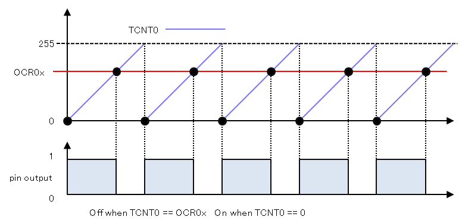

## Fast PWM on ATmega16

It's turn on of hardware fast PWM in ATmega16 uses 2 controlling buttons with checking led.
- 1st button - increase duty cycle
- 2nd button - decrease duty cycle  
- led (PORTC) for work checking of fast PWM.   

## Motivation

Basic structure of fast PWM mode on ATmega16 for begginers. Don't forget to use datasheet!

## Installation

0. You can use another MCUs. All you need is datasheet. Don't forget change pins!  
1. Make project in AVR Studio choosing 8-bit MCU ATmega16.  
2. Copy code from `pwm_check_led.c` into your `main.c` file.
3. Build project.

## License

Free